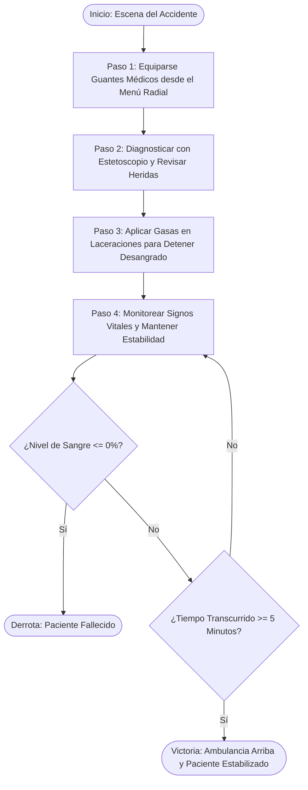

# Documento de Especificación de Jugabilidad (Gameplay Specification)
## Proyecto: Rescate VR: Código Emergencia

---

### 1. Visión General y Contexto
- **Título**: Rescate VR: Código Emergencia
- **Escenario**: Accidente de tránsito en vía urbana (colisión entre vehículo y motocicleta).
- **Rol del Jugador**: Primer respondiente / Paramédico de emergencias.
- **Objetivo del Juego**: Asistir al motociclista herido, diagnosticar sus signos vitales, equipar bioseguridad, tratar las lesiones activas y mantenerlo con vida y estable durante **5 minutos** hasta el arribo de la ambulancia.

---

### 2. Flujo Principal del Juego y Condiciones de Victoria / Derrota

#### Condiciones Clave:
- **Tiempo Total de Misión**: **5 minutos (300 segundos)** de temporizador activo.
- **Condición de Victoria**: Transcurrir los 5 minutos con el paciente con vida y signos vitales en nivel de estabilidad seguro.
- **Condición de Derrota**: El paciente se desangra totalmente (Nivel de sangre llega a 0%) o sus signos vitales colapsan antes de cumplirse los 5 minutos.

---

### 3. Sistema de Inventario: Menú Radial UI (Botiquín)

Para mantener una interacción intuitiva en pantalla/VR, el botiquín funciona mediante una **UI Flotante con Selector Radial (Radial Menu)**:

1. **Apertura del Menú Radial**: El jugador presiona un botón/tecla (o interacción contextual) para desplegar el selector radial flotante del botiquín.
2. **Selección por Dirección**: El jugador navega direccionalmente entre las herramientas disponibles.
3. **Equipamiento / Uso**: Al seleccionar una herramienta del menú radial:
   - **Guantes**: Se equipan en las manos del jugador (Paso obligatorio de bioseguridad).
   - **Gasa / Vendaje**: Se activa en el cursor/mano para hacer clic e interactuar directamente sobre la herida del paciente.
   - **Estetoscopio**: Se coloca sobre el paciente para medir y actualizar sus signos vitales en el HUD.

---

### 4. Sistema de Lesiones y Tratamiento

| Lesión | Descripción y Síntomas | Impacto en el Paciente | Tratamiento / Herramienta Requerida |
| :--- | :--- | :--- | :--- |
| **Laceración Sangrante (Hemorragia Externa)** | Herida visible en extremidades o torso con sangrado activo. | **Desangrado Continuo**: Reduce el Nivel de Sangre en tiempo real. | **Gasa / Vendaje** (desde el Menú Radial) aplicado sobre la herida. |
| **Dificultad Respiratoria** | Obstrucción o ritmo anormal de ventilación. | **Caída de RPM**: Genera desestabilización paulatina. | **Auscultación con Estetoscopio** y Maniobra de Vía Aérea. |
| **Shock Hipovolémico / Alteración Cardíaca** | Pulso débil o irregular por pérdida previa de sangre. | **Caída de BPM y Presión**: Riesgo de paro si continúa sangrando. | Detener la hemorragia con gasas y mantener al paciente en observación. |

---

### 5. Signos Vitales y Feedback en Tiempo Real

El estado del paciente cuenta con dos tipos de actualización en el HUD:

1. **Estado en Tiempo Real (Continuo)**:
   - **Nivel de Sangre / Hemorragia**: Muestra visualmente la tasa de desangrado y la sangre restante del paciente.
   - **Temporizador de Misión**: Cuenta regresiva hacia los 5 minutos.
2. **Datos Actualizables vía Estetoscopio (Bajo Auscultación)**:
   - **Pulso Cardíaco (BPM)**: Ritmo cardíaco actual.
   - **Ritmo Respiratorio (RPM)**: Respiraciones por minuto.
   - **Presión Arterial (mmHg)**: Presión sistólica/diastólica estimada.

---

### 6. Normas de Bioseguridad (Guantes Médicos)
- **Regla Estricta**: La colocación de los **Guantes de Protección** es el primer paso obligatorio.
- Si el jugador intenta tratar las heridas sin haber equipado previamente los guantes, la interfaz advertirá la falta de bioseguridad antes de permitir la curación.

---

### 7. Estructura de Scripts C# Propuesta para Unity

Para implementar esta jugabilidad de forma limpia y limpia en Unity, crearemos la siguiente arquitectura modular:

1. `PatientState.cs`:
   - Administra el nivel de sangre (0 a 100%), tasa de desangrado, pulso (BPM), respiración (RPM) y tiempo de supervivencia (5 min).
   - Eventos de Victoria (`OnPatientSaved`) y Derrota (`OnPatientDied`).
2. `RadialMenuUI.cs`:
   - Renderiza y gestiona la selección del Menú Radial para el Botiquín (Guantes, Gasa, Estetoscopio).
3. `InjuryHandler.cs`:
   - Representa las heridas en el cuerpo del paciente. Detecta cuando el jugador hace clic con la Gasa equipada para detener el sangrado.
4. `MedicalTool.cs`:
   - Define el comportamiento de cada herramienta (Guantes = activa flag de bioseguridad, Estetoscopio = lee y refresca signos vitales en el HUD, Gasa = sana herida).
5. `PatientHUD.cs`:
   - Muestra el temporizador de 5 minutos, la barra de sangre en tiempo real y los datos de signos vitales.

---
*Especificación actualizada según los documentos de diseño y las respuestas del usuario.*
